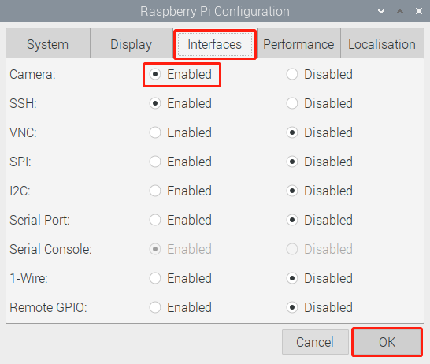

.. _camera_module:

Assemble the Camera Module
==================================

On the camera module or Raspberry Pi, you will find a flat plastic connector. Carefully pull out the black fixing switch until the fixing switch is partially pulled out. Insert the FFC cable into the plastic connector in the direction shown and push the fixing switch back into place.

If the FFC wire is installed correctly, it will be straight and will not pull out when you gently pull on it. If not, reinstall it again.

.. image:: img/connect_ffc.png
    :align: center

.. image:: img/1.10_camera.png
    :align: center

.. warning::

    Do not install the camera with the power on, it may damage your camera.

Open **Raspberry Pi Configuration**.

.. image:: img/raspbian1.png
  :width: 550
  :align: center

In the **Interfaces** option, **Enable** the Camera, and then click **OK**.

In the pop-up prompt box, choose to restart now.

.. image:: img/raspbian3.png
  :width: 400
  :align: center

After the restart is complete, use the following command line to check whether the camera is available.

If the camera screen appears it means that the camera is installed successfully. Otherwise the FFC cable needs to be unplugged and plugged in again.

.. raw:: html

    <run></run>

.. code-block:: shell

    raspivid -o vid.h264

