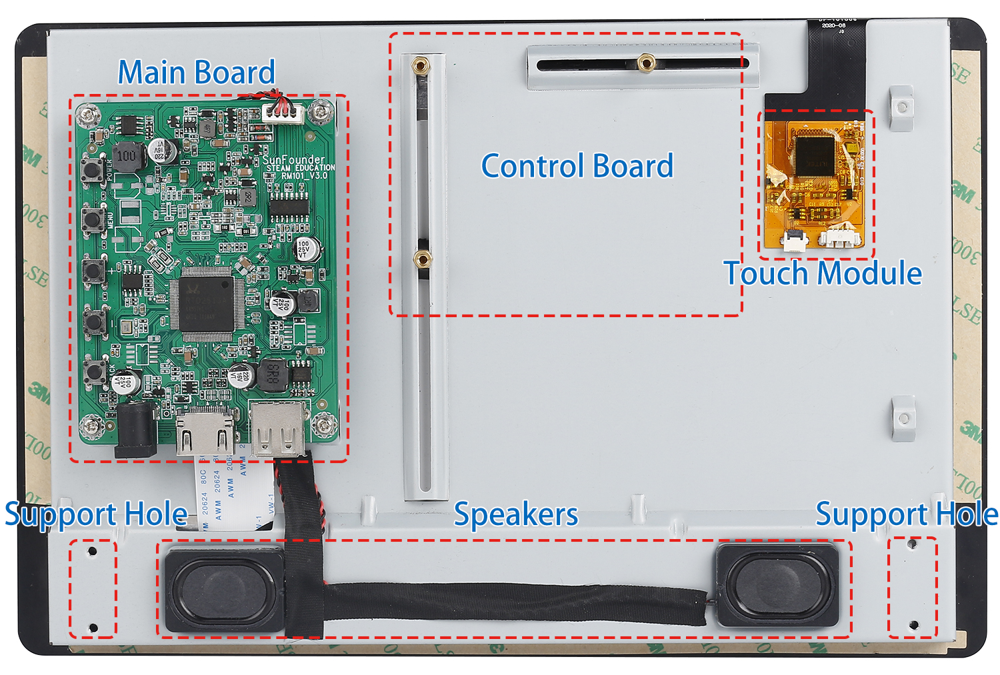
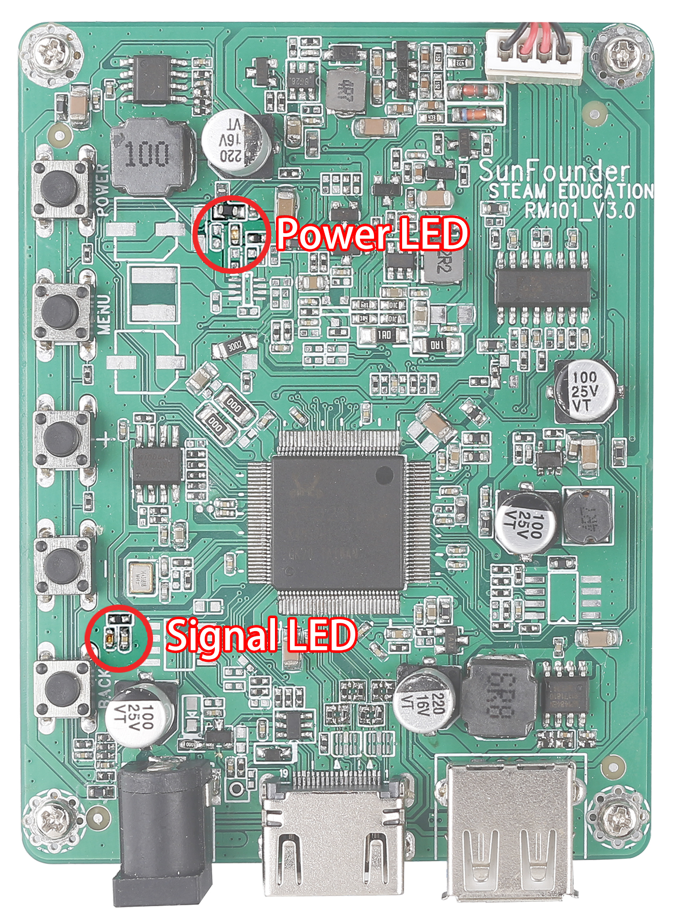
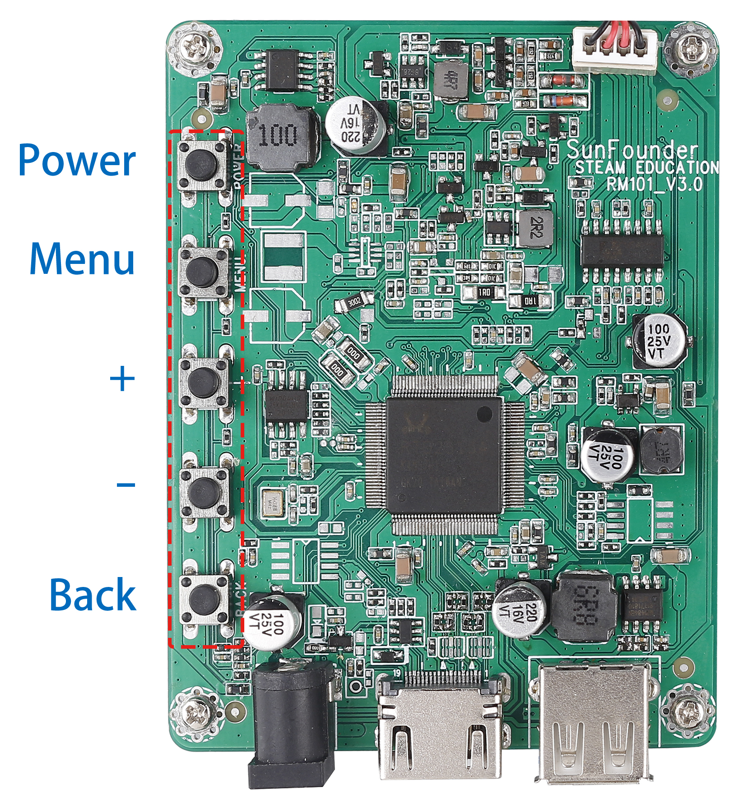
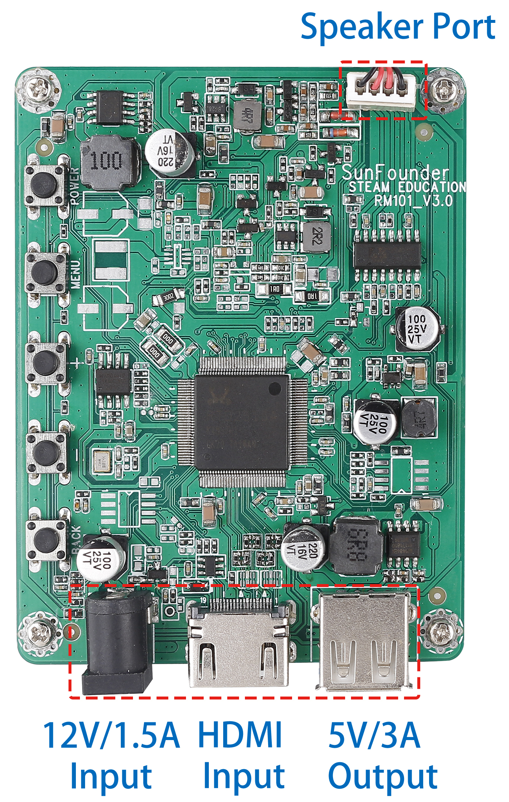

HARDWARE DESCRIPTION
===========================

**Features**

* Resolution: 1280x800
* Plug & Play
* 10-point Touch Capacitive Screen
* Power Input: DC 12V/1.5A
* Power Output: USB Type A 5V/3A
* Aspect Ratio：8:05
* Consumption: 7W
* LCD Type: IPS
* Speaker: 8Ω/2W

**Back**

This is the back of it, with the main board, speakers and touch module pre-installed. To use it, just attach your control board to it and connect all the wires.

**Touch Module**

.. image:: img/touch_module.jpg

There are two types of 4pin connector on the touch module, with the pin serial number shown on the figure.

Here are the definitions of the pins:

* Pin 1: VDD(5V)
* Pin 2: D-
* Pin 3: D+
* Pin 4：GND

**LED Indicators**

* Power on the screen, after the Signal LED flashes one time, it lights on continuously; and the Power LED lights on immediately.
* If there's no HDMI signal, only the Power LED will turn on.
* If there's an HDMI signal, these two LEDs will turn on.
* If you press the power button, the Signal LED will turn off and the Power LED will keep turning on.
* If you remove the power adapter, both of the two LEDs will turn off.

**Buttons**

Buttons on the main board and their functions: 

.. list-table:: 
    :header-rows: 1

    * - 
      - Working
      - Sleep
      - Menu
      - Volume Adjust
      - Brightness Adjust
    * - Power
      - Enter Sleep state
      - Enter Working state
      - Enter Sleep state
      - Enter Sleep state
      - Enter Sleep state
    * - Menu
      - Open the Menu
      - 
      - Confirm
      -
      -
    * - "+"
      - Increase Volume
      -
      - "+"
      - Increase Volume
      - Increase Brightness
    * - "-"
      - Decrease Volume
      -
      - "-"
      - Decrease Volume
      - Decrease Brightness
    * - Back
      - Open the Brightness adjust
      -
      - back
      - back
      - back

**Ports**

On one side of the main board there are ports of HDMI input, 12V power input, and 5V/3A USB power output and Speaker Port. 