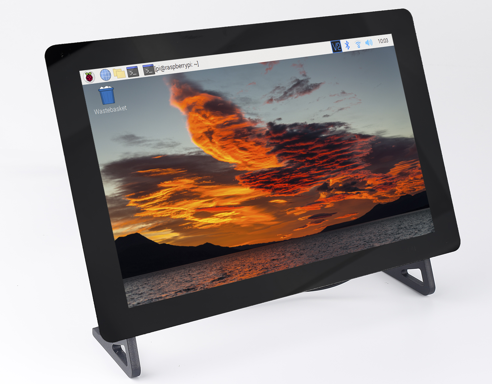

TS-10 Pro 10.1" Touch Screen
===============================

**Introduction**

The SunFounder TS-10 Pro is a 10.1" touch screen designed for the Raspberry Pi and is compatible with most single board computers on the market. 

It is 10-point capacitive touch with a resolution of 1280x800, bringing you perfect visual experience. 

It works with various operating systems including Raspberry Pi OS, Ubuntu, Ubuntu Mate, Windows, Android, and Chrome OS (you may need an USB extension cable). 

With 2 stereo speakers, you can play music or watch videos. It also has a metal stand for standing on your desktop for entertainment or work.

If you encounter problems in using the process, or any suggestions, please feel free to send Email and we will reply as soon as possible.

Here is the Email: cs@sunfounder.com.

.. toctree::
    :maxdepth: 2
    
    hardware_introduction
    list
    assembly_instructions
    quick_guide/quick_user_guide
    project_activities/projects_and_activities
    appendix/appendix
    faq

Copyright Notice
--------------------------

All contents including but not limited to texts, images, and code in this manual are owned by the SunFounder Company. You should only use it for personal study,investigation, enjoyment, or other non-commercial or nonprofit purposes, under therelated regulations and copyrights laws, without infringing the legal rights of the author and relevant right holders. For any individual or organization that uses these for commercial profit without permission, the Company reserves the right to take legal action.

