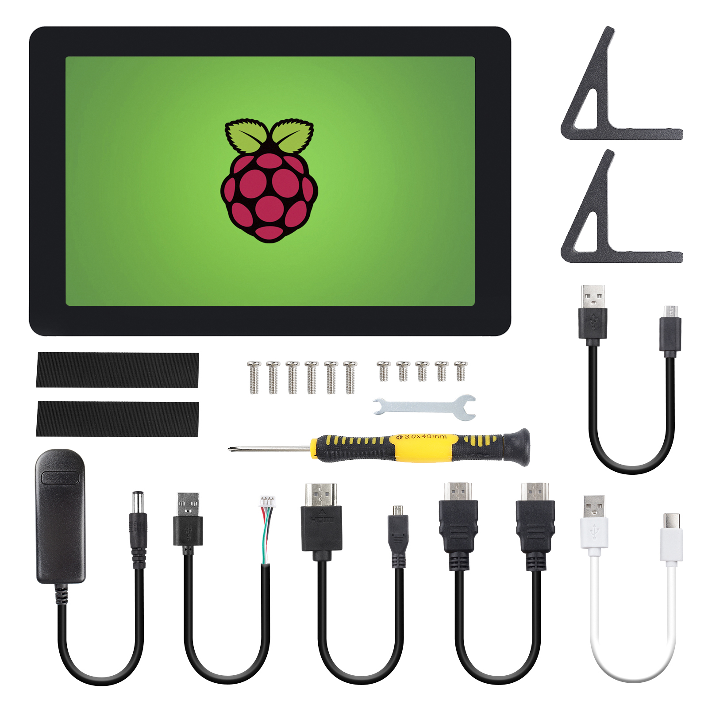

.. note::

    Hello, welcome to the SunFounder Raspberry Pi & Arduino & ESP32 Enthusiasts Community on Facebook! Dive deeper into Raspberry Pi, Arduino, and ESP32 with fellow enthusiasts.

    **Why Join?**

    - **Expert Support**: Solve post-sale issues and technical challenges with help from our community and team.
    - **Learn & Share**: Exchange tips and tutorials to enhance your skills.
    - **Exclusive Previews**: Get early access to new product announcements and sneak peeks.
    - **Special Discounts**: Enjoy exclusive discounts on our newest products.
    - **Festive Promotions and Giveaways**: Take part in giveaways and holiday promotions.

    👉 Ready to explore and create with us? Click [|link_sf_facebook|] and join today!

PACKAGE LIST
=======================

* 10.1'' IPS Touch Screen x 1 
* HDMI to Micro HDMI Cable for Pi4 x 1 
* HDMI to HDMI Cable for Pi3 x 1 
* USB Touch Screen Cable x 1 
* USB-C Cable for Pi4 x 1 
* Micro USB Cable for Pi3 x 1
* Wrenches x 1
* Tape x 2 
* Screwdriver x 1
* Metal Support x 2
* M2.5*4 x 5
* M2.5*8 x 6
* 12V Power Adapter x 1 

