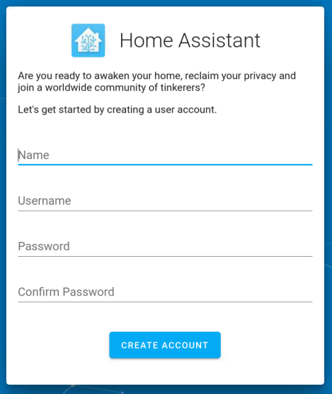
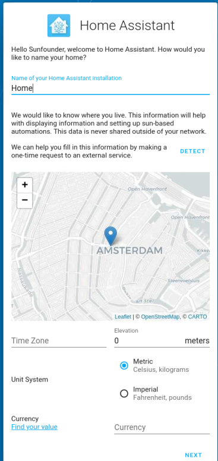
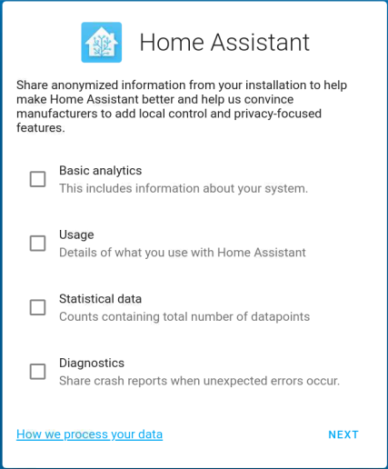
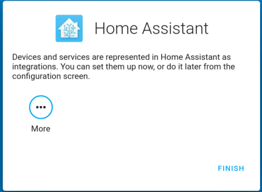
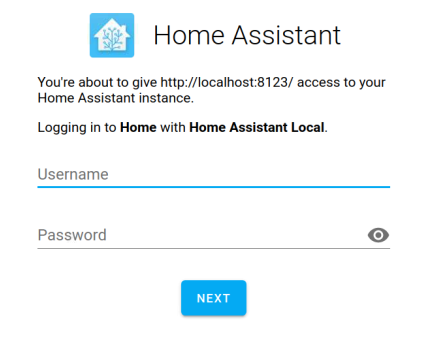
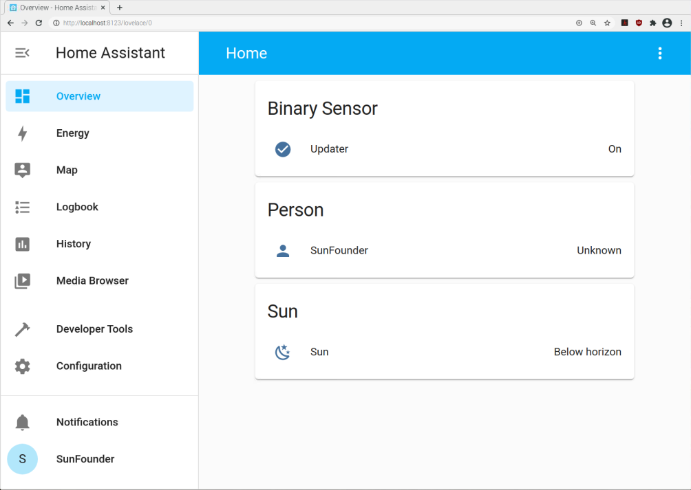

Log In
=========

1. Please set up a username and password for your Home Assistant.

2. Create a name for your home and select your region.

3. Select the content you want to share to Home Assistant.

4. You can choose to configure the device now, or later. It is recommended that beginners configure the device later, as the configuration is described in detail later in the tutorial.
    

5. After setting up, enter your login username and password in the login screen.
   

.. note::
   If the login screen does not jump automatically, please open Home Assistant again via http://localhost:8123.

After logging in successfully, you will enter your Home. 

    
