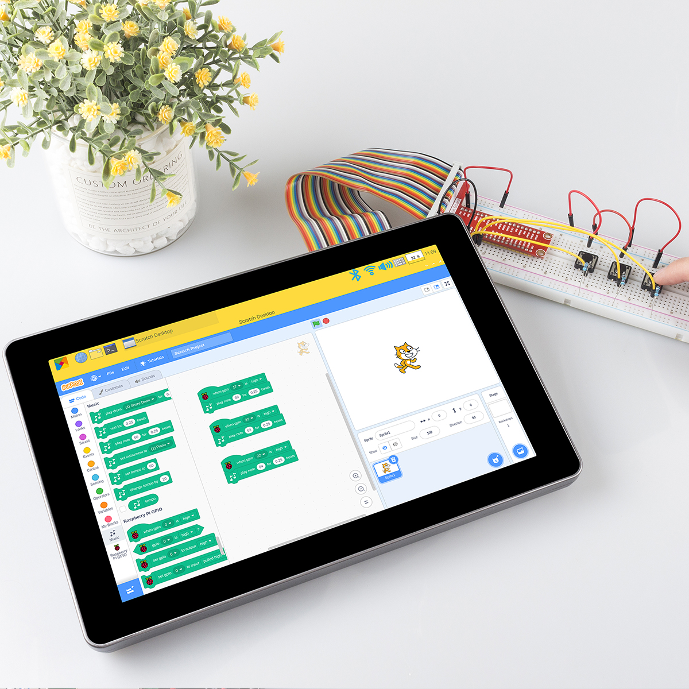
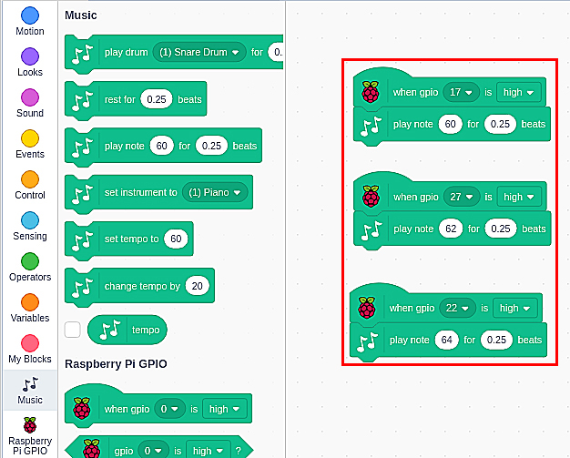

Create Musical Instrument
===================================

Description
-------------

You can turn this screen into a game screen playing with your friends, a smart alarm showing the weather and time, a display monitoring your robot’s action and many other things.

This article will show you how to DIY a Musical Instrument. Let’s take a look!

Required Components
-------------------------------

- A Screen
- 8G+ SD Card
- Scratch 3 (either online or offline)
- Micro SD Card Reader
- 40 Pin Ribbon Cable
- T-Type GPIO Extension Board
- Breadboard
- Button
- 10k Ohm Resistor
- Several Jumper Wires

You Will Learn
---------------------

- Use note functions on Scratch.
- Input the button value from the GPIO pins.

Lesson Guide
--------------

Build the Circuit
^^^^^^^^^^^^^^^^^^^^^^

First connect the GPIO Extension Board, please read :ref:`gpio_board` for specific steps.

Insert the T-type GPIO extension board into the breadboard and build the circuit as shown below.

.. image:: img/paino3.png
  :width: 600
  :align: center

Programming with Scratch 3
^^^^^^^^^^^^^^^^^^^^^^^^^^^^^^^^

On the left of Scratch 3 main page are some neatly arranged blocks with which you can drag to program. In this project, we need to add in other two functions: Music and Raspberry Pi GPIO. The Music function to play instruments and drums, and the Raspberry Pi GPIO function can be used to control the whole pins of Raspberry Pi.

.. image:: img/paino5.jpg
  :width: 600
  :align: center

Tap Add icon at lower left corner and choose Music and Raspberry Pi GPIO to add two functions on the left of the main page of the Scratch 3.

.. image:: img/paino6.jpg
  :width: 700
  :align: center

Finished the program.

Press these three buttons on the breadboard and there emits the tones “Do, Re, Mi”.

.. image:: img/paino8.jpg
  :width: 600
  :align: center
