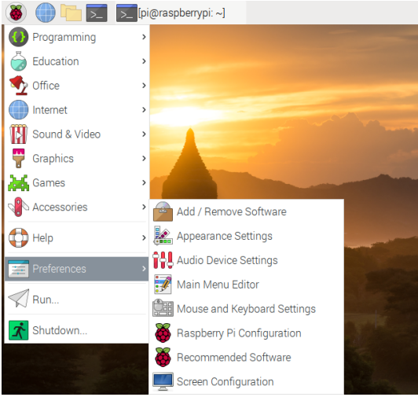
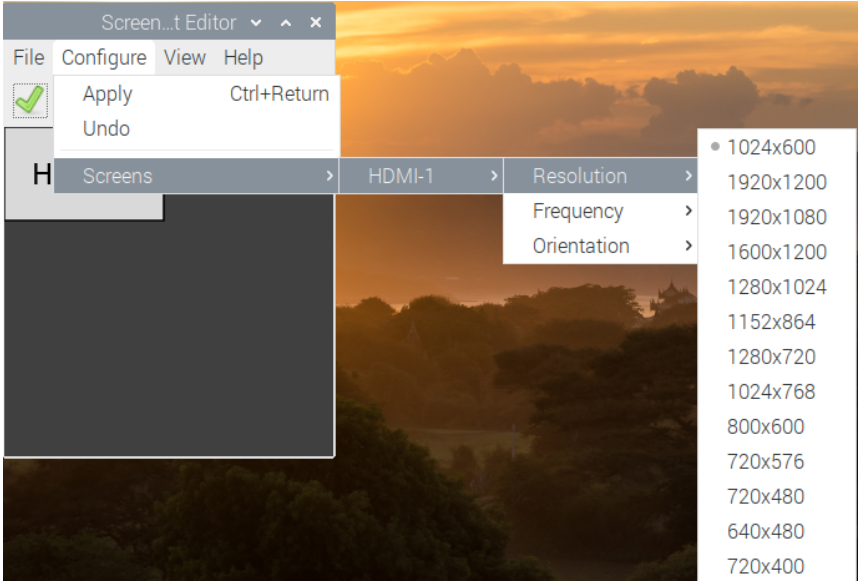
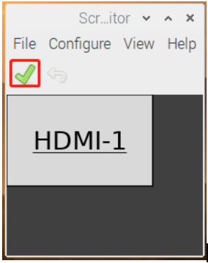

Adjust the Resolution
============================

For the Raspberry Pi 3 and the lower versions, you need reset the resolution ratio as  follows. As for Raspberry Pi 4, when you start up it, the resolution is optimum. If you want to change its resolution, please refer to the next part.  

**For Raspberry Pi 3 or Lower Version**

**Step 1: Open config.txt.**

.. code::

	sudo nano /boot/config.txt
	
**Step 2: Modify the /boot/config.txt file.**

1) Define a custom CVT mode (since Raspberry Pi uses the standard rate when 1024x600 is not included, you need to set the aspect ratio close to 16:9) and add the following lines below #hdmi_force_hotplug=1.

.. code::

	hdmi_cvt=1024 600 60 3 0 0 0

hdmi_cvt=<width> <height> <framerate> <aspect> <margins> <interlace>

+-----------+------------+------------------------------------------------------------+
| value     | Default    | Description                                                |
+-----------+------------+------------------------------------------------------------+
| width     | (required) | width in pixels                                            |
+-----------+------------+------------------------------------------------------------+
| height    | (required) | height in pixels                                           |
+-----------+------------+------------------------------------------------------------+
| framerate | (required) | framerate in Hz                                            |
+-----------+------------+------------------------------------------------------------+
| aspect    | 3          | aspect ratio 1=4:3, 2=14:9, 3=16:9, 4=5:4, 5=16:10, 6=15:9 |
+-----------+------------+------------------------------------------------------------+
| margins   | 0          | 0=margins disabled, 1=margins enabled                      |
+-----------+------------+------------------------------------------------------------+
| interlace | 0          | 0=progressive, 1=interlaced                                |
+-----------+------------+------------------------------------------------------------+
| rb        | 0          | 0=normal, 1=reduced blanking                               |
+-----------+------------+------------------------------------------------------------+

	
2) Find the following lines, delete the "#" mark and modify the value like this:

.. code::

	hdmi_group=2
	hdmi_mode=87
	....
	hdmi_drive=2
	
**hdmi_group=2** means DMT (Display Monitor Timings, the standard typically used on monitors)
**hdmi_mode=87** indicates we create a new hdmi mode named 87. 
**hdmi_drive=2** selects the Normal HDMI mode. 

After the modification is done, save and exit. For more details about configuring config.txt, refer to Raspberry Pi official website: 
https://www.raspberrypi.org/documentation/configuration/config-txt.md. 

**Step 3: Reboot Raspberry Pi.**

Reboot the Raspberry pi with the command sudo reboot. 

.. raw:: html

    <run></run>

.. code::

	sudo reboot
	
**For Raspberry Pi 4**

1) Click the **Raspberry Pi icon** -> **Preferences** -> **Screen Configuration**.

2) Then choose **Configure** -> **Screens** -> **HDMI-1** -> **Resolution** -> **choose the resolution that you want**.

3) After that you need to click the **tick icon** to save your configure.

