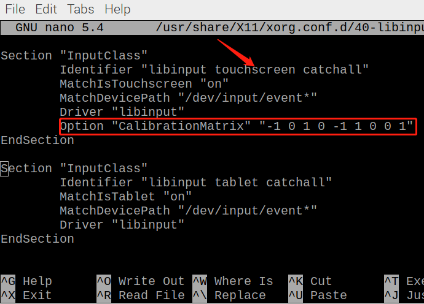

Rotate the Display and Touch Angle
=========================================

After the Raspberry Pi is turned on, if you find that the display or touch angle is not correct, or you need to rotate to other angles during use, you can follow the tutorial below to achieve them.

Rotate the Display Angle
---------------------------------

There are two ways to rotate the display angle, one way is from the Raspberry Pi desktop, and the other way is using the command line.

**1. Set from the Raspberry Pi Desktop**

Click the **Raspberry Pi icon** -> **Preferences** -> **Screen Configuration**.

    .. image:: img/image11.png

Then click **Configure** -> **Screens** -> **HDMI-1** -> **Orientation**, then select the angle you want to rotate.

    .. image:: img/orientation.png

Click the green checkbox to take effect.

    .. image:: img/check.png

.. note::

    * After checking the box, you need to confirm the changes by clicking **OK** within 10 seconds, otherwise it will go back to the previous angle.

    .. image:: img/invert_ok.png

    * For Debian Bullseye system, there is only one option - **Inverted**, if you want to rotate to another angle, you need to set it from command line.

**2. Using the Command Line**

To make this change stay after a reboot, do the following to rotate your display.

Open the ``autostart`` file.

.. raw:: html

    <run></run>

.. code-block:: shell

    sudo nano /etc/xdg/lxsession/LXDE-pi/autostart

Add the following line to the end.

.. code-block::
    
    @xrandr --output HDMI-1 --rotate right

* ``right`` represents the direction of rotation, and there are 4 directions to choose from: ``normal``, ``right``, ``left`` and ``inverted``.

After restarting the Raspberry Pi, you will see the effect of rotation.

.. raw:: html

    <run></run>

.. code-block:: shell
    
    sudo reboot

Rotate Touch Angle 
--------------------------

Run the following command to open the ``40-libinput.conf`` file.

.. raw:: html

    <run></run>

.. code-block:: shell

    sudo nano /usr/share/X11/xorg.conf.d/40-libinput.conf

Find the touchscreen section and add the corresponding rotation angle to it.

* 0 degrees: ``Option "CalibrationMatrix" "1 0 0 0 1 0 0 0 1"``
* 90 degrees: ``Option "CalibrationMatrix" "0 1 0 -1 0 1 0 0 1"``
* 180 degrees: ``Option "CalibrationMatrix" "-1 0 1 0 -1 1 0 0 1"``
* 270 degrees: ``Option "CalibrationMatrix" "0 -1 1 1 0 0 0 0 1"``

.. note::
    For some Raspberry Pis, you may set the rotation angle of touch to 90°, but eventually you find that it is not 90° and you need to manually alternate these 4 sets of values.

After restarting the Raspberry Pi, you will see the effect of rotation.

.. raw:: html

    <run></run>

.. code-block:: shell
    
    sudo reboot